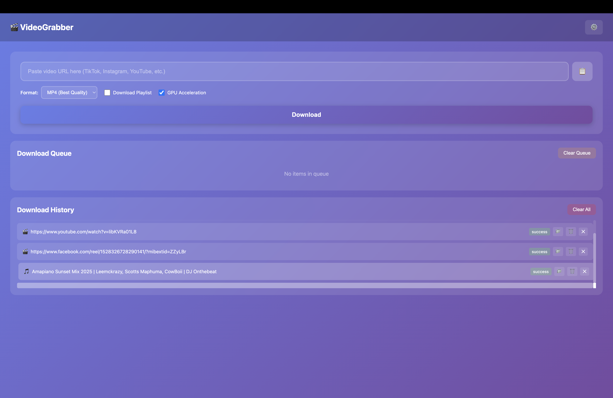
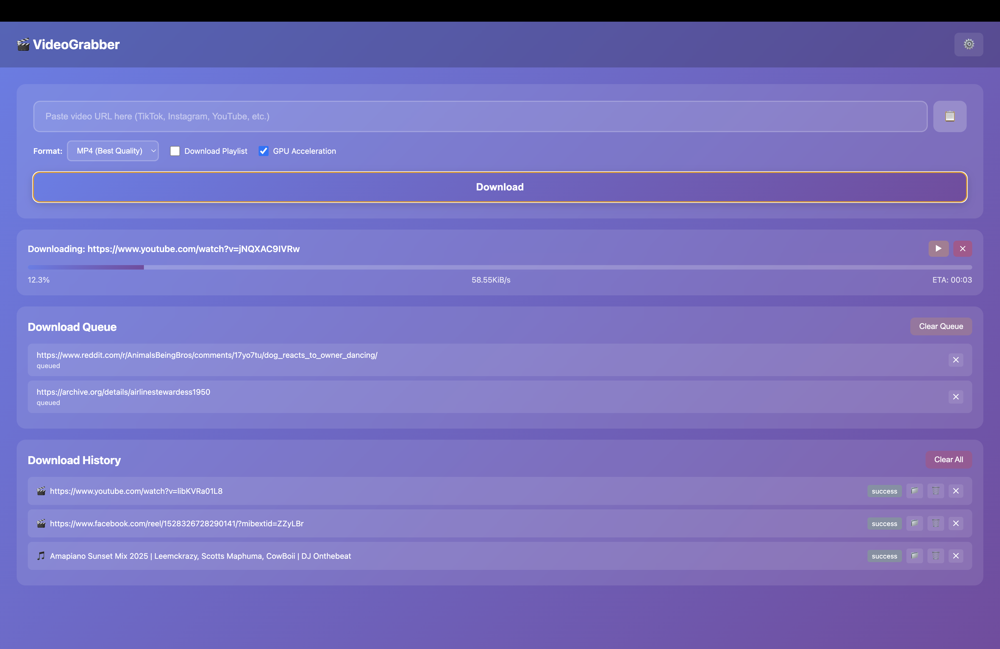
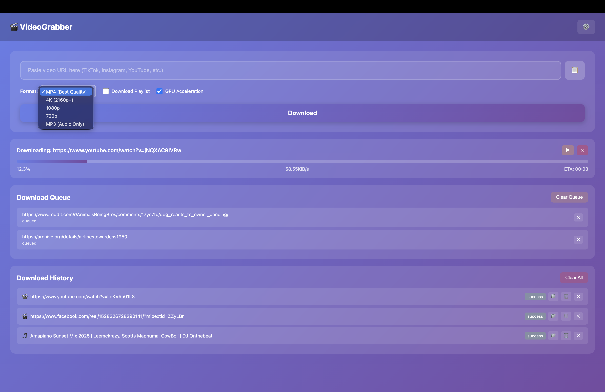

# 🎬 VideoGrabber

> A powerful, cross-platform video downloader with GPU acceleration, download queue, and support for 1000+ websites.

[](https://github.com/martin-sack/Video-Grabber/releases)
[](https://github.com/martin-sack/Video-Grabber/releases)
[](https://github.com/martin-sack/Video-Grabber/releases)
[](https://github.com/martin-sack/Video-Grabber/releases)
[](LICENSE)
[](https://github.com/martin-sack/Video-Grabber/stargazers)


*Download videos from 1000+ sites with GPU acceleration and batch queue*

---

## � Why V ideoGrabber?

- **🌐 1000+ Sites** - Powered by yt-dlp: TikTok, Instagram, YouTube, Facebook, Reddit, Twitter, Vimeo, and more
- **🎯 No Watermarks** - Download TikTok videos without watermarks
- **⚡ Download Queue** - Batch download multiple videos with pause/resume support
- **🎮 GPU Acceleration** - Hardware-accelerated processing (2-6x faster on M1/M2/M3, NVIDIA, AMD)
- **📦 Zero Dependencies** - Bundled binaries work offline, no Python or external tools needed
- **🎨 Beautiful UI** - Modern Electron desktop app with intuitive controls
- **🆓 100% Free** - Open source (MIT), no ads, no premium tiers, no limits

---

## ✨ Features

### Core Features
- � **UnUiversal Support** - Download from 1000+ websites
- 🎯 **Smart Quality Detection** - Automatically selects best quality (1080p, 4K, etc.)
- 🎵 **Audio Extraction** - Download audio-only as MP3
- � **Clilpboard Integration** - Auto-detect URLs from clipboard
- � ***Real-time Progress** - Live download progress with speed and ETA
- � ***Video Preview** - See thumbnail and metadata before downloading
- 📁 **Custom Save Location** - Choose where to save your downloads

### Advanced Features
- ⚡ **Download Queue** - Batch download multiple videos sequentially
- 🎮 **GPU Acceleration** - Hardware-accelerated video processing (2-6x faster)
- 📊 **Format Selection** - MP4, 4K, 1080p, 720p, MP3
- ⏸️ **Pause/Resume** - Control your downloads
- 🗑️ **File Management** - Delete files, show in folder, manage history
- 💾 **Persistent History** - Never lose track of your downloads
- 🎨 **Modern UI** - Beautiful gradient interface with smooth animations

### Supported Platforms
TikTok • Instagram • YouTube • Facebook • Twitter/X • Reddit • Vimeo • Dailymotion • Twitch • And 1000+ more!

---

## 📸 Screenshots

### Main Interface

*Beautiful gradient UI with video preview and real-time progress*

### Download Queue

*Manage multiple downloads with individual controls*

### History Management

*Track all downloads with clickable items and file management*

---

## 🚀 Quick Start

### Prerequisites
- Node.js 16+ ([Download](https://nodejs.org/))

### Installation & Run

```bash
# Clone the repository
git clone https://github.com/martin-sack/Video-Grabber.git
cd Video-Grabber

# Install dependencies
npm install

# Download yt-dlp binaries
./setup-binaries.sh  # macOS/Linux
# or
setup-binaries.bat   # Windows

# Run the app
npm start
```

---

## 📦 Download Pre-built App

**Don't want to build from source?** Download the latest release:

👉 **[Download for macOS / Windows / Linux](https://github.com/martin-sack/Video-Grabber/releases)**

- **macOS**: Download `.dmg`, drag to Applications
- **Windows**: Download `.exe` installer or portable version
- **Linux**: Download `.AppImage` or `.deb`

---

## 🛠️ Build from Source

```bash
# Build for your platform
npm run build:mac    # macOS (creates .dmg)
npm run build:win    # Windows (creates .exe)
npm run build:linux  # Linux (creates .AppImage)

# Or build for all platforms
npm run build
```

Built apps will be in the `dist/` folder.

---

## 📖 Usage

### Basic Download
1. Copy any video URL
2. Paste into VideoGrabber (auto-detects from clipboard)
3. Select format (MP4, 4K, 1080p, 720p, MP3)
4. Click Download
5. Find your video in `~/VideoGrabberDownloads`

### Batch Download
1. Paste URL 1 → Click Download
2. Paste URL 2 → Click Download
3. Paste URL 3 → Click Download
4. All videos download sequentially in the queue

### GPU-Accelerated 4K
1. Select "4K (2160p+)" from format dropdown
2. Ensure "GPU Acceleration" is checked
3. Paste URL and download
4. Enjoy 2-6x faster processing!

---

## 🎮 GPU Acceleration

GPU acceleration speeds up video **processing** (not downloading) by 2-6x:

| Platform | Technology | Performance |
|----------|------------|-------------|
| **macOS** | VideoToolbox (M1/M2/M3) | 2-6x faster |
| **Windows (NVIDIA)** | NVENC | 2-5x faster |
| **Windows (AMD)** | AMF | 2-4x faster |

**Example:** 4K video processing: 3 minutes → 30 seconds

See [GPU_ACCELERATION_EXPLAINED.md](GPU_ACCELERATION_EXPLAINED.md) for details.

---

## 📂 Project Structure

```
videograbber/
├── main.js                 # Electron main process
├── preload.js              # IPC security bridge
├── renderer.js             # Frontend logic
├── queue.js                # Download queue manager
├── getYtDlpExecutable.js   # Binary path resolver
├── index.html              # UI markup
├── styles.css              # Modern styling
├── resources/bin/          # Bundled yt-dlp binaries
└── dist/                   # Built applications
```

---

## 📚 Documentation

- [START_HERE.md](START_HERE.md) - Quick start guide
- [QUICKSTART.md](QUICKSTART.md) - Fast setup instructions
- [INSTALL.md](INSTALL.md) - Detailed installation guide
- [ARCHITECTURE.md](ARCHITECTURE.md) - Technical architecture
- [FEATURES.md](FEATURES.md) - Complete feature list
- [GPU_ACCELERATION_EXPLAINED.md](GPU_ACCELERATION_EXPLAINED.md) - GPU acceleration details
- [COMMANDS.md](COMMANDS.md) - Command reference

---

## 🆘 Troubleshooting

### "yt-dlp not found" Error
The app includes bundled binaries. If you still see this error:
```bash
./setup-binaries.sh  # Re-download binaries
npm run build        # Rebuild the app
```

### Download Fails
- Check internet connection
- Verify URL is valid and accessible
- Some sites may have restrictions or require authentication

### App Won't Open (macOS)
- Right-click app → Open (first time only)
- Or: System Settings → Privacy & Security → Open Anyway

### GPU Not Working
- Ensure GPU drivers are updated
- Check console for GPU codec detection
- Disable GPU acceleration if issues persist

---

## 🤝 Contributing

Contributions are welcome! Please see [CONTRIBUTING.md](CONTRIBUTING.md) for guidelines.

---

## 📄 License

This project is licensed under the MIT License - see the [LICENSE](LICENSE) file for details.

---

## ⚠️ Legal & Ethical Use

**Important:** VideoGrabber is intended for **personal, offline use only**. Users must:

- ✅ Respect copyright laws and intellectual property rights
- ✅ Comply with terms of service of video platforms
- ✅ Only download content you have permission to access
- ✅ Use downloaded content for personal, non-commercial purposes

**The developers are not responsible for any misuse of this software.** Please use responsibly and ethically.

---

## 🙏 Credits

- Built with [Electron](https://www.electronjs.org/)
- Powered by [yt-dlp](https://github.com/yt-dlp/yt-dlp)
- Inspired by professional download managers

---

## 📞 Support

- 🐛 [Report a Bug](https://github.com/martin-sack/Video-Grabber/issues)
- � [LRequest a Feature](https://github.com/martin-sack/Video-Grabber/issues)
- ⭐ [Star this Project](https://github.com/martin-sack/Video-Grabber)

---

## 🔄 Version History

### v1.0.0 (Current)
- ✅ Download queue system
- ✅ GPU acceleration
- ✅ Format selection (MP4, 4K, 1080p, 720p, MP3)
- ✅ Pause/resume downloads
- ✅ File management
- ✅ Persistent history
- ✅ Modern UI
- ✅ Cross-platform support

See [CHANGELOG.md](CHANGELOG.md) for full history.

---

**Made with ❤️ by the VideoGrabber Team**

**Download videos from anywhere, anytime!** 🚀

[⬆ Back to top](#-videograbber)
